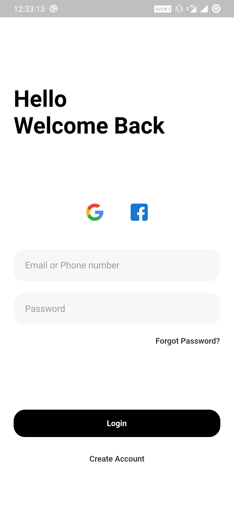
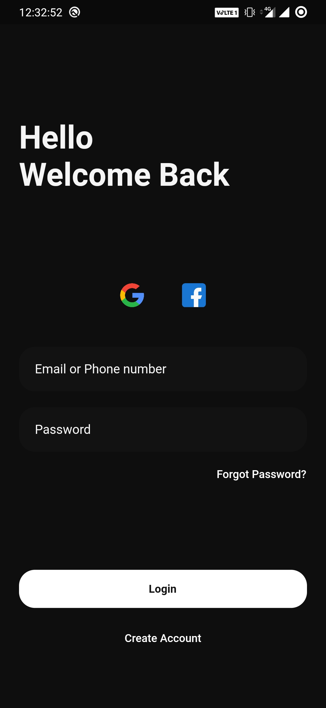

# Flutter Login UI with Light & Dark Mode

    Note: This project uses Flutter v2.0.1

## About

A basic Login Screen UI with Light and Dark Mode

## Build

    Note: Proceed only if you wish to upgrade to Flutter v2.0.1

1. Run 'flutter upgrade' in the terminal to upgrade flutter to Latest Stable Release
2. Clone or download the repository
3. Run 'pub get' in terminal to install packages
4. Connect device or virtual device to the computer
5. Run 'flutter run --release' to compile to release mode

## Screenshots

&nbsp;

## MIT LICENSE

> Copyright (c) 2021 Arsh Shaikh
>
> Permission is hereby granted, free of charge, to any person obtaining a copy
> of this software and associated documentation files (the "Software"), to deal
> in the Software without restriction, including without limitation the rights
> to use, copy, modify, merge, publish, distribute, sublicense, and/or sell
> copies of the Software, and to permit persons to whom the Software is
> furnished to do so, subject to the following conditions:
>
> The above copyright notice and this permission notice shall be included in all
> copies or substantial portions of the Software.
>
> THE SOFTWARE IS PROVIDED "AS IS", WITHOUT WARRANTY OF ANY KIND, EXPRESS OR
> IMPLIED, INCLUDING BUT NOT LIMITED TO THE WARRANTIES OF MERCHANTABILITY,
> FITNESS FOR A PARTICULAR PURPOSE AND NONINFRINGEMENT. IN NO EVENT SHALL THE
> AUTHORS OR COPYRIGHT HOLDERS BE LIABLE FOR ANY CLAIM, DAMAGES OR OTHER
> LIABILITY, WHETHER IN AN ACTION OF CONTRACT, TORT OR OTHERWISE, ARISING FROM,
> OUT OF OR IN CONNECTION WITH THE SOFTWARE OR THE USE OR OTHER DEALINGS IN THE
> SOFTWARE.
